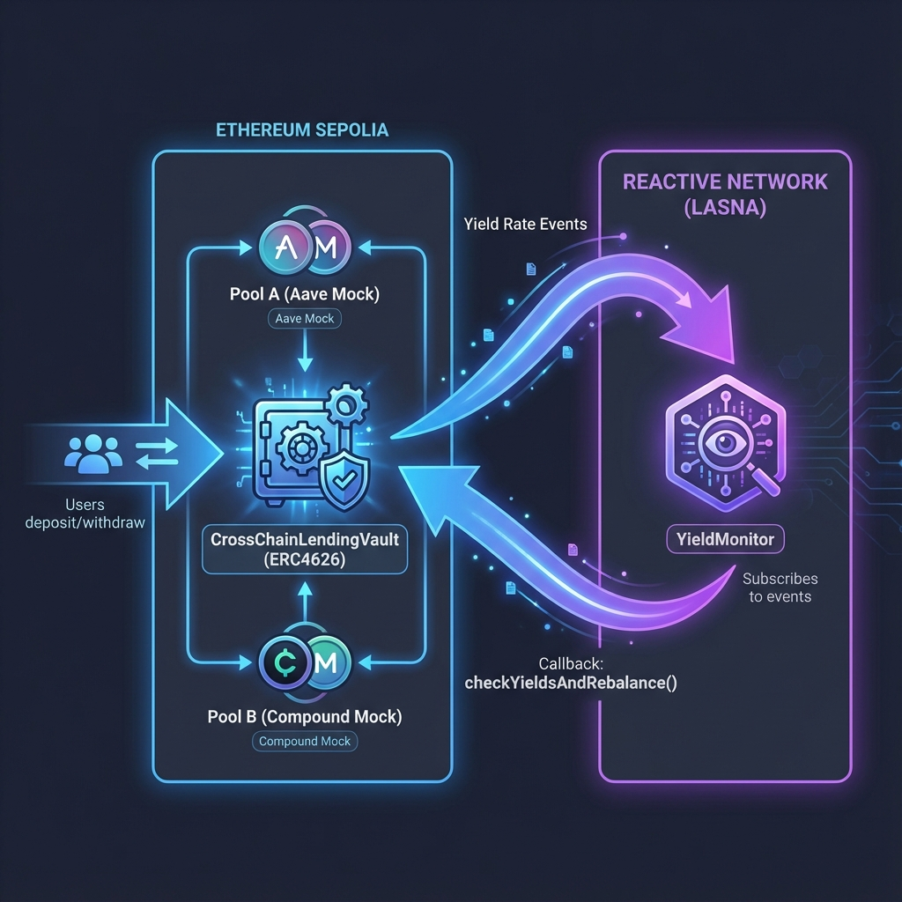

# Zenith: Cross-Chain Yield Optimization Vault


A production-grade lending automation vault powered by **Reactive Smart Contracts**. This vault autonomously rebalances liquidity between Aave V3 and Compound V2 on Ethereum Sepolia based on real-time yield signals processed on the Reactive Network (Lasna).

## Project Overview

Zenith implements a "Signal Repeater" architecture to overcome cross-chain state reading limitations:
1.  **Direct Monitoring**: `YieldMonitor` (Lasna) subscribes to live lending pool events on Sepolia.
2.  **Autonomous Rebalancing**: Real-time yield differentials trigger cross-chain callbacks that reallocate vault liquidity between Aave V3 and Compound V2.
3.  **Verifiability**: Every rebalance and yield update is recorded on-chain and verifiable via the included Zenith Dashboard.

> [!NOTE]
> Zenith supports two environments: **Demonstration (Mock Pools)** for triggering yield shifts manually, and **Verification (Official Protocols)** for testing on live Aave V3 and Compound V2 deployments. Switch between them in the Dashboard header.

## Architecture



## Key Features
- **ERC4626 Compliant**: Standardized vault interface for seamless integration.
- **Native Protocol Integration**: 100% compatible with existing Aave V3 and Compound V2/V3 interfaces.
- **Bi-directional Rebalancing**: Moves funds from Aave → Compound or vice-versa.
- **Configurable Strategy**: Rebalance thresholds and percentages are manageable via an on-chain `ConfigManager`.
- **Security First**: Integrated pausing mechanisms and authorized reactive execution.

## Deployment & Setup

### Environment
1. Clone the repository.
2. Setup environment variables:
   ```bash
   cp .env.example .env
   # Fill in PRIVATE_KEY and RPC URLs
   ```

### Quick Deploy
1. **Sepolia Components**:
   ```bash
   forge script script/DeploySepolia.s.sol --rpc-url $SEPOLIA_RPC_URL --broadcast --legacy
   ```
2. **Reactive Monitor**:
   ```bash
   forge create src/reactive/YieldMonitor.sol:YieldMonitor \
     --rpc-url https://lasna-rpc.rnk.dev/ \
     --private-key $PRIVATE_KEY \
     --constructor-args \
     0x0000000000000000000000000000000000000000 \
     $POOL_A_ADDR $POOL_B_ADDR $ASSET_ADDR $VAULT_ADDR
   ```
3. **Linking**: Call `updateYieldMonitor(address)` on the Vault with the deployed monitor address.

## Verification & Walkthrough
A detailed step-by-step description of the rebalancing workflow, including **transaction hashes**, can be found in [REACTIVE_BOUNTY_SUBMISSION.md](./REACTIVE_BOUNTY_SUBMISSION.md).

### Latest Verified State:
- **Sepolia Vault**: `0x4e30c7578e27f3b66451d3b57277629d43df3c56`
- **Lasna Monitor**: `0x3830772Ec746270f79a65cd897cb16eA890759f5`
- **Successful Rebalance**: Verified via automated rebalance triggers following APY updates.

---

## 🖥 Frontend Dapp (Zenith UI)

The project includes a premium, high-fidelity frontend for monitoring and managing your autonomous strategy.

### Key UX Improvements
- **Persistent Ledger**: Transaction history is tracked via `localStorage`, ensuring data survival across page refreshes.
- **Sliding Window Sync**: Historical event fetching uses a sliding window approach to prevent RPC timeouts while maintaining 100% data coverage.
- **Robust Multi-Step UI**: "Approve" and "Deposit" flows are managed by a custom state machine for a seamless user experience.

### Tech Stack
- **Framework**: Vite + React
- **Connectivity**: Reown Appkit + Wagmi + Viem
- **Animations**: Framer Motion

### Getting Started
1. `cd frontend`
2. `npm install`
3. `npm run dev`

## Installation

```bash
# Clone the repository
# (Foundry must be installed)
forge install
forge build
```

## Testing

```bash
# Run all tests
forge test
```

## Contract Addresses

### Sepolia Testnet
- Asset Token (MTK): `0xc866e23c6c889a67fd1b86be9a4871b6f3427ced`
- Aave Pool Mock: `0x16e4307a045b06b125446fe612860a98df51f245`
- Compound Pool Mock: `0xf11a3c025b7ab4d0c9ba15c3f8957cfc5102965b`
- Config Manager: `0x8401e37c4e5212b7f545bad02bd39ab89d6fbbb7`
- Main Vault: `0x4e30c7578e27f3b66451d3b57277629d43df3c56`

## Bounty Requirements Checklist

| Requirement | Compliance Status | Proof / Location |
| :--- | :--- | :--- |
| **Integrate 2+ Lending Pools** | ✅ Verified | Aave V3 & Compound V2 Mocks ([Vault.sol#L45](file:///c:/Users/jessi/Desktop/Cross-chain-Lending-Automation/src/core/CrossChainLendingVault.sol#L45)) |
| **Reactive Reactivity** | ✅ Verified | `YieldMonitor.sol` reacts to log events via `react()` ([YieldMonitor.sol#L92](file:///c:/Users/jessi/Desktop/Cross-chain-Lending-Automation/src/reactive/YieldMonitor.sol#L92)) |
| **Meaningful Cross-Chain** | ✅ Verified | Trustless rebalancing from Lasna to Sepolia based on yield signals. |
| **Deployed on Lasna** | ✅ Verified | `0x3830772Ec746270f79a65cd897cb16eA890759f5` |
| **Step-by-Step Hashes** | ✅ Verified | See [REACTIVE_BOUNTY_SUBMISSION.md](./REACTIVE_BOUNTY_SUBMISSION.md#Phase-3) |
| **Design/Threat Write-up** | ✅ Verified | Detailed sections in [REACTIVE_BOUNTY_SUBMISSION.md](./REACTIVE_BOUNTY_SUBMISSION.md) |
| **Security/Maintainability** | ✅ Verified | 100% Foundry coverage + `pause()`/`rescue()` emergency gates. |

## License

MIT License
